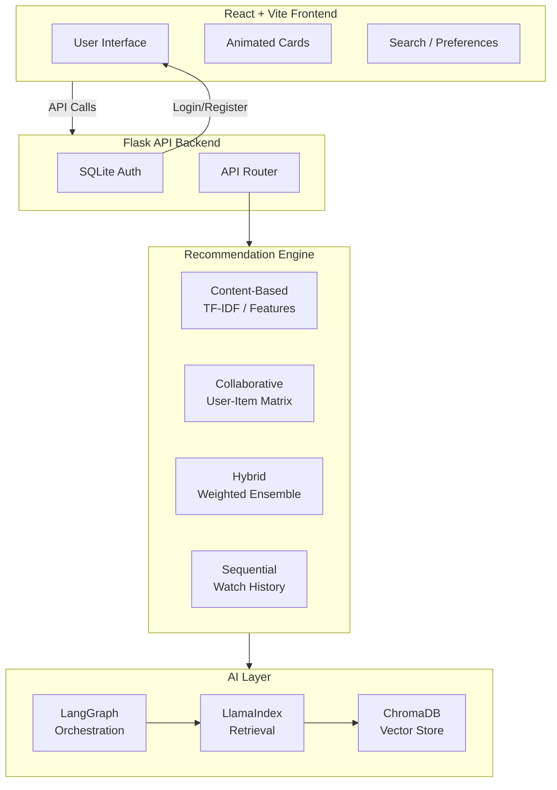

# CineMatch AI 🎬🍿

[](https://github.com/krishnakumarbhat/cinematch/actions/workflows/ci.yml)
[](https://react.dev)
[](https://flask.palletsprojects.com/)

A **movie, series, and anime recommendation** app using multiple AI recommendation strategies. Features a React + Vite frontend with animated UI and a Flask API backend powered by LangGraph orchestration and ChromaDB vector search.

## 🏗️ Architecture



## 🚀 Features

- **4 Recommendation Approaches**: Content-Based, Collaborative, Hybrid, Sequential
- **LangGraph Orchestration**: AI pipeline for intelligent ranking
- **ChromaDB Retrieval**: Semantic search through movie metadata
- **Animated UI**: Runtime animations and animated knowledge output cards
- **SQLite Auth**: Registration and login system

## 🛠️ Tech Stack

| Layer           | Technology                              |
| --------------- | --------------------------------------- |
| Frontend        | React 18, TypeScript, Vite              |
| Backend         | Flask, Python 3.10+                     |
| Auth            | SQLite                                  |
| AI Pipeline     | LangGraph, LlamaIndex, ChromaDB         |
| Recommendations | TF-IDF, Collaborative Filtering, Hybrid |

## 📦 Setup

### Backend

```bash
cd backend
python3 -m venv .venv
source .venv/bin/activate
pip install -r requirements.txt
cd ..
python3 app.py
```

Backend URL: `http://localhost:5002`

### Frontend

```bash
npm install
# Optional: echo "VITE_API_BASE_URL=http://localhost:5002" > .env.local
npm run dev
```

Frontend URL: `http://localhost:3000`

### Production Build

```bash
npm run build
# Open http://localhost:5002 — Flask serves the built frontend
```

## 📁 Project Structure

```
cinematch/
├── app.py                 # Flask entry point
├── App.tsx                # React root component
├── backend/
│   ├── data/              # Movie/anime datasets
│   ├── recommenders/      # Recommendation algorithms
│   ├── database.py        # SQLite helpers
│   └── requirements.txt
├── components/            # React UI components
├── services/              # API service layer
├── types.ts               # TypeScript types
├── index.html
├── vite.config.ts
├── .github/workflows/     # CI/CD pipeline
├── .gitignore
└── README.md
```

## 📝 License

MIT License

## 🤝 Contributing

1. Fork the repository
2. Create a feature branch: `git checkout -b feature-name`
3. Commit your changes: `git commit -m 'Add feature'`
4. Push to the branch: `git push origin feature-name`
5. Open a pull request
